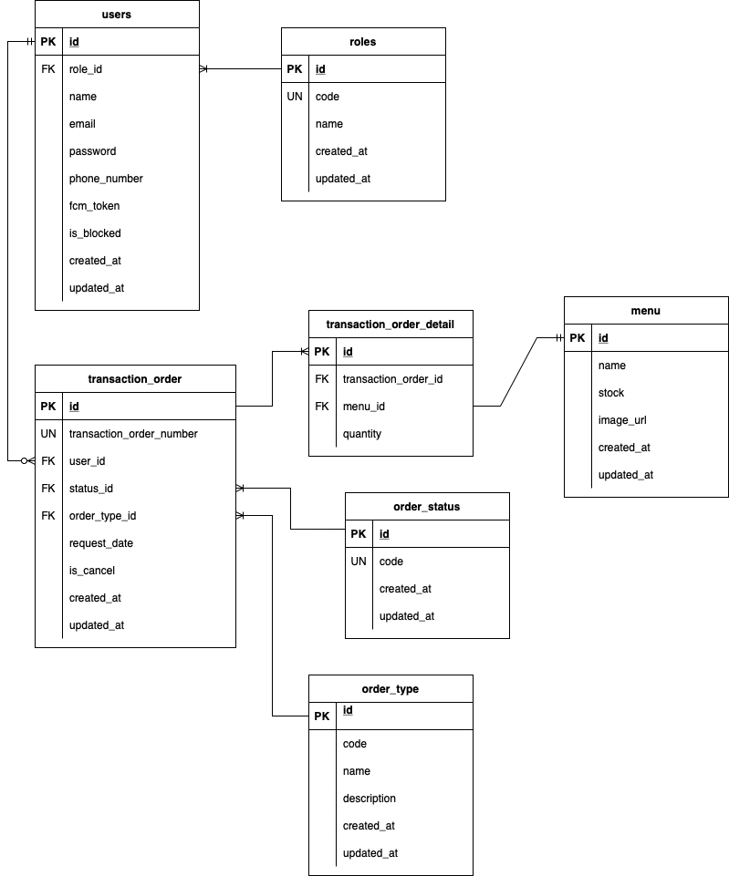

# Order App Service

Current repo is a backend service for order app. This is a simple order app where there are 3 actors within the app. There are customer, seller and admin. The app purpose is to provide a simple order management system between seller and customer. 

This project was a template from this [repo](https://github.com/evrone/go-clean-template).

## Installation

I presume you already have cloned the repo and you are in the root directory. Don't forget to set up the database in your local machine.

- Init the go modules

    ```bash
    make init 
    ```

- Make tidy 
    
    ```bash
    make tidy
    ```

- Copy and modify the config.yml file and adjust the values to your needs.

- Migrate the database
    ```bash
    make migration
    ```

- Run the app
    ```bash
    make run
    ```

## ERD



## Usecase

Comming soon...

## Related projects

- [Order App Client Flutter](git@github.com:glovenkevin/order-app-client.git)